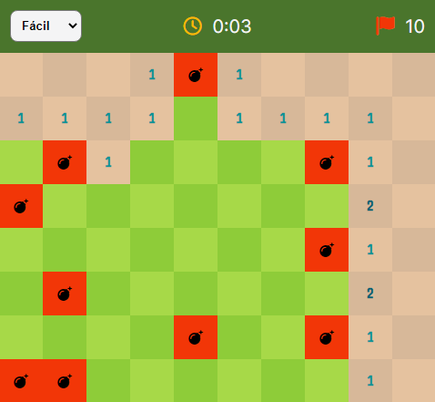

<h1 align="center">Campo Minado</h1>

  

## 💣 Projeto

O Campo minado é um jogo que tem como objetivo revelar um campo de minas sem que alguma seja detonada.

 

## 💻 Tecnologias

Esse projeto foi desenvolvido com as seguintes tecnologias:

- [React](https://reactjs.org)
- [TypeScript](https://www.typescriptlang.org/)
- [Vite](https://vitejs.dev/)

## 🚀 Como executar

- Clone o repositório
- Instale as dependências com `yarn`
- Inicie a aplicação com `yarn dev`

## 📄 Licença

Esse projeto está sob a licença MIT. Veja o arquivo [LICENSE](LICENSE) para mais detalhes.

---

Desenvolvido por Tiago Faria.